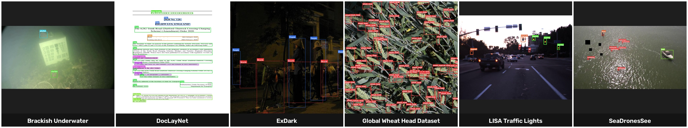

# DetectionBench

> DetectionBench exists to make benchmark results on real-world and underrepresented object detection datasets as reproducible, comparable, and trustworthy as benchmarks on COCO have become.


<p align="center">
  
</p>

## Why DetectionBench?

Modern object detection research is overwhelmingly evaluated on a small number of canonical datasets such as COCO. In practice, however, computer vision systems are deployed in domains such as aerial robotics, maritime search and rescue, agriculture, underwater inspection, autonomous driving, document understanding, and many others where datasets are smaller, more specialized, and benchmark results are often difficult to compare.

DetectionBench provides a standardized benchmarking framework for these real-world and underrepresented datasets. By using common dataset adapters, reproducible training recipes, identical evaluation protocols, and unified hardware profiling, DetectionBench enables fair comparison of modern object detectors across diverse application domains.

DetectionBench is a Hydra-driven framework for preparing datasets, training models, evaluating performance, and benchmarking modern object detectors under standardized experimental conditions.

## Supported Models

DetectionBench wraps two model families behind one CLI, trained and evaluated with identical recipes (same augmentation, early stopping, and metrics) regardless of family:

| Family | Backend | Example checkpoints | Entrypoints |
| --- | --- | --- | --- |
| **YOLO** | Ultralytics | `yolov8n/s/m`, `yolov9c/e`, `yolo11n/s/m`, ... | `detectionbench-train`, `detectionbench-evaluate`, `detectionbench-infer` |
| **RT-DETR** | Ultralytics | `rtdetr-l`, `rtdetr-x` | Same as YOLO — dispatched automatically by model name |
| **RF-DETR** | Roboflow `rfdetr` | `rfdetr-nano`, `rfdetr-small`, `rfdetr-medium`, `rfdetr-large` | `detectionbench-train-rfdetr`, `detectionbench-evaluate-rfdetr` |

Any Ultralytics-registered YOLO or RT-DETR checkpoint name works out of the box — the YOLO family isn't a fixed enum, `YOLOTrainer` just passes the name straight through to Ultralytics. Every model, regardless of family, gets hardware profiling (latency, FPS, VRAM, parameters, FLOPs) via `detectionbench-benchmark` and per-class evaluation metrics via `detectionbench-evaluate` / `detectionbench-evaluate-rfdetr`.

## Supported Datasets

| Dataset | Domain | Classes | Images | License | Status |
| --- | --- | --- | --- | --- | --- |
| DocLayNet | Document layout analysis | 11 | 80,863 | CDLA-Permissive-1.0 | ✅ Working — [ dataset](https://huggingface.co/datasets/docling-project/DocLayNet-v1.2) |
| ExDark | Low-light robustness | 12 | 7,344 | BSD-3-Clause* | ✅ Working — [ dataset](https://huggingface.co/datasets/dronefreak/ExDark) |
| GWHD 2021 | Agriculture (wheat heads) | 1 | 6,515 | CC BY 4.0 | ✅ Working — [ dataset](https://huggingface.co/datasets/dronefreak/GWHD) |
| SeaDronesSee | Maritime UAV / search & rescue | 5 | 10,477** | CC0-1.0 | ✅ Working — [card](../dataset_cards/seadronessee/README.md) |
| Brackish Underwater | Marine animal detection | 6 | 14,674 | CC BY 4.0 | ✅ Working — [ dataset](https://huggingface.co/datasets/dronefreak/Brackish) |
| LISA Traffic Lights | Autonomous driving (traffic lights) | 7 | 43,017 | CC BY-NC-SA 4.0 | ✅ Working — [ dataset](https://huggingface.co/datasets/dronefreak/LISA-Traffic-Lights) |

\* BSD-3-Clause is the license text itself; the original authors separately request non-commercial use — see the dataset card.
\*\* No public test-set labels for this dataset; train+valid only.

Each dataset is a self-contained adapter under `src/detectionbench/datasets/` that converts its raw format into a canonical COCO layout — everything downstream (COCO↔YOLO conversion, training, evaluation, inference, benchmarking) is dataset-agnostic. See `src/detectionbench/datasets/doclaynet.py` for a fully worked adapter.

## Installation

```bash
python -m venv .venv && source .venv/bin/activate
pip install -e ".[dev]"          # core + dev tooling
pip install -e ".[rfdetr]"       # + RF-DETR training/eval
pip install -e ".[coco]"         # + pycocotools
pip install -e ".[benchmark]"    # + hardware-profiling extras (psutil, thop, fvcore, torchinfo, nvidia-ml-py)
```

## Usage

```bash
# 1. Convert a raw dataset download into the canonical COCO layout
detectionbench-prepare --dataset doclaynet --raw-dir /path/to/DocLayNet_core --output-dir /path/to/doclaynet_coco

# 2. Bridge into Ultralytics YOLO format (for YOLO/RT-DETR training)
detectionbench-convert-yolo /path/to/doclaynet_coco /path/to/doclaynet_yolo

# 3. Train + evaluate (Hydra config group `dataset=<key>` selects the dataset)
detectionbench-train dataset=doclaynet model.name=yolov8n
detectionbench-train-rfdetr dataset=doclaynet model.name=rfdetr-nano

# 4. Evaluate / infer / benchmark a checkpoint directly
detectionbench-evaluate --checkpoint experiments/yolov8n/weights/best.pt --model yolov8n --dataset doclaynet --dataset-yaml /path/to/doclaynet_yolo/data.yaml
detectionbench-infer --checkpoint experiments/yolov8n/weights/best.pt --model yolov8n --dataset doclaynet --input /path/to/images
detectionbench-benchmark --model yolov8n --checkpoint experiments/yolov8n/weights/best.pt
```

## License

Code is licensed under Apache-2.0 (see `LICENSE`). Each benchmarked dataset
retains its own original license — see the corresponding adapter's docstring
under `src/detectionbench/datasets/`, `CITATION.cff`, and (once published)
its own dataset card under `dataset_cards/`.
