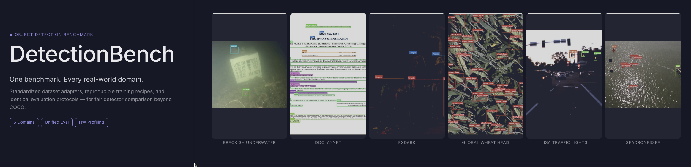

<p align="center">
  
</p>

# DetectionBench

<!-- ROW 1: Core Identity (What this project is) -->
<div style="display: flex; justify-content: center; align-items: center; gap: 8px; flex-wrap: wrap; margin-bottom: 24px;">
  <!-- Project Identity -->
  

  <!-- Tech Stack & Quality -->
  <a href="https://www.python.org/downloads/">
    
  </a>
  <a href="https://pytorch.org/">
    
  </a>
  <a href="https://github.com/dronefreak/DetectionBench/actions/workflows/ci.yml">
    
  </a>
  <a href="https://github.com/astral-sh/ruff">
    
  </a>

  <!-- Metadata -->
  
  
</div>

> DetectionBench exists to make benchmark results on real-world and underrepresented object detection datasets as reproducible, comparable, and trustworthy as benchmarks on COCO have become.

## Why DetectionBench?

Modern object detection research is overwhelmingly evaluated on a small number of canonical datasets such as COCO. In practice, however, computer vision systems are deployed in domains such as aerial robotics, maritime search and rescue, agriculture, underwater inspection, autonomous driving, document understanding, and many others where datasets are smaller, more specialized, and benchmark results are often difficult to compare.

DetectionBench provides a standardized benchmarking framework for these real-world and underrepresented datasets. By using common dataset adapters, reproducible training recipes, identical evaluation protocols, and unified hardware profiling, DetectionBench enables fair comparison of modern object detectors across diverse application domains.

DetectionBench is a Hydra-driven framework for preparing datasets, training models, evaluating performance, and benchmarking modern object detectors under standardized experimental conditions.

## Supported Models

DetectionBench wraps two model families behind one CLI, trained and evaluated with identical recipes (same augmentation, early stopping, and metrics) regardless of family:

| Family | Backend | Example checkpoints | Entrypoints |
| --- | --- | --- | --- |
| **YOLO** | Ultralytics | `yolov8n/s/m`, `yolov9c/e`, `yolo11n/s/m`, ... | `detectionbench-train`, `detectionbench-evaluate`, `detectionbench-infer` |
| **RT-DETR** | Ultralytics | `rtdetr-l`, `rtdetr-x` | `detectionbench-train`, `detectionbench-evaluate`, `detectionbench-infer` |
| **RF-DETR** | Roboflow `rfdetr` | `rfdetr-nano`, `rfdetr-small`, `rfdetr-medium`, `rfdetr-large` | `detectionbench-train`, `detectionbench-evaluate`, `detectionbench-infer` |

Any Ultralytics-registered YOLO or RT-DETR checkpoint name works out of the box — the YOLO family isn't a fixed enum, `YOLOTrainer` just passes the name straight through to Ultralytics. Every model, regardless of family, gets hardware profiling (latency, FPS, VRAM, parameters, FLOPs) via `detectionbench-benchmark` and per-class evaluation metrics via `detectionbench-evaluate`.

`detectionbench-train` and `detectionbench-evaluate` are each one command for every model family: both inspect `model.name=...` / `--model` and dispatch to the Ultralytics or RF-DETR implementation automatically, so adding a new checkpoint name (or a new RF-DETR size) never needs a new entrypoint.

## Supported Datasets

| Dataset | Primary Task | Domain | Classes | Images | License | Source |
| :--- | :--- | :--- | :--- | :--- | :--- | :--- |
| **DocLayNet** | Object Detection / Layout Analysis | Document | 11 | 80,863 | CDLA-Permissive-1.0 | [Hugging Face](https://huggingface.co/datasets/docling-project/DocLayNet-v1.2) |
| **ExDark** | Object Detection | Low-light Robustness | 12 | 7,344 | BSD-3-Clause [^1] | [Hugging Face](https://huggingface.co/datasets/dronefreak/ExDark) |
| **GWHD 2021** | Object Detection | Agriculture (Wheat Heads) | 1 | 6,515 | CC BY 4.0 | [Hugging Face](https://huggingface.co/datasets/dronefreak/GWHD) |
| **SeaDronesSee** | Object Detection / Tracking | Maritime UAV / Search & Rescue | 5 | 10,477 [^2] | CC0-1.0 | [Dataset Card](../dataset_cards/seadronessee/README.md) |
| **Brackish Underwater** | Object Detection | Marine Animal Detection | 6 | 14,674 | CC BY 4.0 | [Hugging Face](https://huggingface.co/datasets/dronefreak/Brackish) |
| **LISA Traffic Lights** | Object Detection | Autonomous Driving | 7 | 43,017 | CC BY-NC-SA 4.0 | [Hugging Face](https://huggingface.co/datasets/dronefreak/LISA-Traffic-Lights) |
| **VisDrone-DET** | Object Detection | Aerial / UAV Surveillance | 11 | 8,629 [^3] | CC BY-NC-SA 3.0 | [Hugging Face](https://huggingface.co/datasets/Voxel51/VisDrone2019-DET) |

[^1]: BSD-3-Clause is the license text itself; the original authors separately request non-commercial use. See the dataset card for compliance details.
[^2]: No public test-set labels are available for this dataset; this count reflects train and validation splits only.
[^3]: Train + val + test-dev splits only (6,471 + 548 + 1,610); the official test-challenge split (1,580 images) has no public ground truth.

Each dataset is a self-contained adapter under `src/detectionbench/datasets/` that converts its raw format into a canonical COCO layout — everything downstream (COCO↔YOLO conversion, training, evaluation, inference, benchmarking) is dataset-agnostic. See `src/detectionbench/datasets/doclaynet.py` for a fully worked adapter.

<!-- LEADERBOARD:START -->
## Leaderboards

Curated comparison across DetectionBench's [v1 model shortlist](../ROADMAP.md) only -- the same models across every dataset, for a fair comparison. Every trained model (shortlist and extras) gets its own full HF model card with its own complete leaderboard; this table is the smaller, cross-dataset-comparable summary.

### ExDark

| Rank | Model | mAP@50 | mAP@50-95 | Precision | Recall | HF Model |
| --- | --- | --- | --- | --- | --- | --- |
| 1 | RF-DETR Small | 88.98 | 61.67 | 83.07 | 81.89 | [dronefreak/exdark-rfdetr-small](https://huggingface.co/dronefreak/exdark-rfdetr-small) |
| 2 | RF-DETR Medium | 88.64 | 62.55 | 86.6 | 79.46 | [dronefreak/exdark-rfdetr-medium](https://huggingface.co/dronefreak/exdark-rfdetr-medium) |
| 3 | RF-DETR Nano | 85.27 | 58.01 | 85.18 | 74.67 | [dronefreak/exdark-rfdetr-nano](https://huggingface.co/dronefreak/exdark-rfdetr-nano) |
| 4 | YOLOv26m | 76.54 | 50.02 | 82.29 | 68.83 | [dronefreak/exdark-yolo26m](https://huggingface.co/dronefreak/exdark-yolo26m) |
| 5 | YOLOv8m | 74.69 | 48.05 | 78.4 | 69.17 | [dronefreak/exdark-yolov8m](https://huggingface.co/dronefreak/exdark-yolov8m) |
| 6 | YOLOv11x | 74.41 | 48.98 | 81.87 | 67.05 | [dronefreak/exdark-yolo11x](https://huggingface.co/dronefreak/exdark-yolo11x) |
| 7 | YOLOv26s | 74.0 | 48.32 | 79.11 | 65.59 | [dronefreak/exdark-yolo26s](https://huggingface.co/dronefreak/exdark-yolo26s) |
| 8 | YOLOv8s | 73.01 | 45.85 | 78.26 | 65.13 | [dronefreak/exdark-yolov8s](https://huggingface.co/dronefreak/exdark-yolov8s) |
| 9 | YOLOv11n | 70.36 | 44.72 | 76.18 | 61.15 | [dronefreak/exdark-yolo11n](https://huggingface.co/dronefreak/exdark-yolo11n) |

### LISA Traffic Lights

| Rank | Model | mAP@50 | mAP@50-95 | Precision | Recall | HF Model |
| --- | --- | --- | --- | --- | --- | --- |
| 1 | YOLOv26m | 29.08 | 13.68 | 43.79 | 29.71 | [dronefreak/lisa-yolo26m](https://huggingface.co/dronefreak/lisa-yolo26m) |
| 2 | RF-DETR Nano | 27.47 | 12.16 | 74.96 | 52.57 | [dronefreak/lisa-rfdetr-nano](https://huggingface.co/dronefreak/lisa-rfdetr-nano) |
| 3 | YOLOv26s | 26.91 | 12.82 | 42.47 | 26.43 | [dronefreak/lisa-yolo26s](https://huggingface.co/dronefreak/lisa-yolo26s) |
| 4 | YOLOv11x | 26.4 | 13.09 | 53.98 | 24.38 | [dronefreak/lisa-yolo11x](https://huggingface.co/dronefreak/lisa-yolo11x) |
| 5 | YOLOv8m | 25.07 | 11.91 | 38.16 | 25.15 | [dronefreak/lisa-yolov8m](https://huggingface.co/dronefreak/lisa-yolov8m) |

### SeaDronesSee

| Rank | Model | mAP@50 | mAP@50-95 | Precision | Recall | HF Model |
| --- | --- | --- | --- | --- | --- | --- |
| 1 | YOLOv8s | 72.94 | 43.05 | 84.52 | 71.25 | [dronefreak/seadronessee-yolov8s](https://huggingface.co/dronefreak/seadronessee-yolov8s) |
| 2 | YOLOv11n | 69.93 | 40.41 | 82.87 | 69.04 | [dronefreak/seadronessee-yolo11n](https://huggingface.co/dronefreak/seadronessee-yolo11n) |
<!-- LEADERBOARD:END -->

## Installation

```bash
python -m venv .venv && source .venv/bin/activate
pip install -e ".[dev]"          # core + dev tooling
pip install -e ".[rfdetr]"       # + RF-DETR training/eval
pip install -e ".[coco]"         # + pycocotools
pip install -e ".[benchmark]"    # + hardware-profiling extras (psutil, thop, fvcore, torchinfo, nvidia-ml-py)
```

## Usage

```bash
# 1. Convert a raw dataset download into the canonical COCO layout
detectionbench-prepare-coco --dataset doclaynet --raw-dir /path/to/DocLayNet_core --output-dir /path/to/doclaynet_coco

# 2. Bridge into Ultralytics YOLO format (for YOLO/RT-DETR training)
detectionbench-convert-coco-to-yolo --input-dir /path/to/doclaynet_coco --output-dir /path/to/doclaynet_yolo

# 3. Train + evaluate (Hydra config group `dataset=<key>` selects the dataset;
#    one entrypoint for every model family, dispatched by `model.name=`)
detectionbench-train dataset=doclaynet model.name=yolov8n
detectionbench-train dataset=doclaynet model.name=rfdetr-nano

# 4. Evaluate / infer / benchmark a checkpoint directly (--dataset-yaml is
#    optional -- it auto-resolves from configs/dataset/<key>.yaml if omitted;
#    the same command works unchanged for model=rfdetr-nano)
detectionbench-evaluate --checkpoint experiments/yolov8n/weights/best.pt --model yolov8n --dataset doclaynet
detectionbench-infer --checkpoint experiments/yolov8n/weights/best.pt --model yolov8n --dataset doclaynet --input /path/to/images
detectionbench-benchmark --model yolov8n --checkpoint experiments/yolov8n/weights/best.pt
```

## License

Code is licensed under Apache-2.0 (see `LICENSE`). Each benchmarked dataset
retains its own original license — see the corresponding adapter's docstring
under `src/detectionbench/datasets/`, `CITATION.cff`, and (once published)
its own dataset card under `dataset_cards/`.
