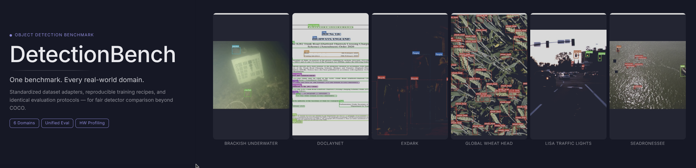

<p align="center">
  
</p>

# DetectionBench

<!-- ROW 1: Core Identity (What this project is) -->
<div style="display: flex; justify-content: center; align-items: center; gap: 8px; flex-wrap: wrap; margin-bottom: 24px;">
  <!-- Project Identity -->
  

  <!-- Tech Stack & Quality -->
  <a href="https://www.python.org/downloads/">
    
  </a>
  <a href="https://pytorch.org/">
    
  </a>
  <a href="https://github.com/dronefreak/DetectionBench/actions/workflows/ci.yml">
    
  </a>
  <a href="https://github.com/astral-sh/ruff">
    
  </a>

  <!-- Metadata -->
  
  
</div>

> DetectionBench exists to make benchmark results on real-world and underrepresented object detection datasets as reproducible, comparable, and trustworthy as benchmarks on COCO have become.

## Why DetectionBench?

Modern object detection research is overwhelmingly evaluated on a small number of canonical datasets such as COCO. In practice, computer vision systems are deployed in domains — aerial robotics, maritime search and rescue, agriculture, underwater inspection, autonomous driving, document understanding — where datasets are smaller, more specialized, and benchmark results are hard to compare.

DetectionBench is a Hydra-driven framework for preparing those datasets, training models, evaluating performance, and benchmarking modern object detectors under standardized conditions: common dataset adapters, reproducible training recipes, identical evaluation protocols, and unified hardware profiling, so detectors can be compared fairly across application domains.

## Supported Models

DetectionBench wraps two model families behind one CLI, trained and evaluated with identical recipes (same augmentation, early stopping, and metrics) regardless of family:

| Family | Backend | Example checkpoints | Entrypoints |
| --- | --- | --- | --- |
| **YOLO** | Ultralytics | `yolov8n/s/m`, `yolov9c/e`, `yolo11n/s/m`, `yolo26n/s/m`, ... | `detectionbench-train`, `detectionbench-evaluate`, `detectionbench-infer` |
| **RT-DETR** | Ultralytics | `rtdetr-l`, `rtdetr-x` | `detectionbench-train`, `detectionbench-evaluate`, `detectionbench-infer` |
| **RF-DETR** | Roboflow `rfdetr` | `rfdetr-nano`, `rfdetr-small`, `rfdetr-medium`, `rfdetr-large` | `detectionbench-train`, `detectionbench-evaluate`, `detectionbench-infer` |

Any Ultralytics-registered YOLO or RT-DETR checkpoint name works out of the box — the YOLO family isn't a fixed enum, `YOLOTrainer` passes the name straight through to Ultralytics. `detectionbench-train` and `detectionbench-evaluate` are each one command for every family: both inspect `model.name=` / `--model` and dispatch to the Ultralytics or RF-DETR path automatically, so a new checkpoint name (or RF-DETR size) never needs a new entrypoint. Every model, regardless of family, also gets hardware profiling (latency, FPS, VRAM, parameters, FLOPs) via `detectionbench-benchmark` and per-class metrics via `detectionbench-evaluate`.

## Supported Datasets

| Dataset | Primary Task | Domain | Classes | Images | License | Source |
| :--- | :--- | :--- | :--- | :--- | :--- | :--- |
| **DocLayNet** | Object Detection / Layout Analysis | Document | 11 | 80,863 | CDLA-Permissive-1.0 | [Hugging Face](https://huggingface.co/datasets/docling-project/DocLayNet-v1.2) |
| **ExDark** | Object Detection | Low-light Robustness | 12 | 7,344 | BSD-3-Clause [^1] | [Hugging Face](https://huggingface.co/datasets/dronefreak/ExDark) |
| **GWHD 2021** | Object Detection | Agriculture (Wheat Heads) | 1 | 6,515 | CC BY 4.0 | [Hugging Face](https://huggingface.co/datasets/dronefreak/GWHD) |
| **SeaDronesSee** | Object Detection / Tracking | Maritime UAV / Search & Rescue | 5 | 10,477 [^2] | CC0-1.0 | [Dataset Card](../dataset_cards/seadronessee/README.md) |
| **Brackish Underwater** | Object Detection | Marine Animal Detection | 6 | 14,674 | CC BY 4.0 | [Hugging Face](https://huggingface.co/datasets/dronefreak/Brackish) |
| **LISA Traffic Lights** | Object Detection | Autonomous Driving | 7 | 43,017 | CC BY-NC-SA 4.0 | [Hugging Face](https://huggingface.co/datasets/dronefreak/LISA-Traffic-Lights) |
| **VisDrone-DET** | Object Detection | Aerial / UAV Surveillance | 11 | 8,629 [^3] | CC BY-NC-SA 3.0 | [Hugging Face](https://huggingface.co/datasets/Voxel51/VisDrone2019-DET) |
| **GC10-DET** | Object Detection | Industrial / Metallic Surface Defect | 10 | 2,300 [^4] | CC BY 4.0 | [GitHub](https://github.com/lvxiaoming2019/GC10-DET-Metallic-Surface-Defect-Datasets) |
| **RDD2022** | Object Detection | Road Infrastructure / Pavement Damage | 4 | 38,385 [^5] | CC BY-SA 4.0 | [GitHub](https://github.com/sekilab/RoadDamageDetector) |
| **BDD100K 2018** | Object Detection | Autonomous Driving | 10 | 79,863 [^16] | BDD100K Data License (non-commercial redistribution permitted) [^16] | [Hugging Face](https://huggingface.co/datasets/dronefreak/BDD100K) |
| **HRP4K** | Object Detection | Road Infrastructure / Pothole Detection | 1 | 4,086 [^17] | CC BY 4.0 | [Hugging Face](https://huggingface.co/datasets/dronefreak/HRP4K) |
| **PKLot** | Object Detection | Smart Parking / Occupancy Detection | 2 | 12,416 [^18] | CC BY 4.0 | [Hugging Face](https://huggingface.co/datasets/dronefreak/PKLot) |
| **KITTI** | Object Detection | Autonomous Driving | 8 | 7,481 [^19] | CC BY-NC-SA 3.0 | [Hugging Face](https://huggingface.co/datasets/dronefreak/KITTI) |
| **CeyMo** | Object Detection | Autonomous Driving / Road Marking Detection | 11 | 2,887 [^20] | MIT | [GitHub](https://github.com/oshadajay/CeyMo) |
| **UAVDT** | Object Detection / Tracking | Aerial / UAV Vehicle Surveillance | 3 | 77,819 [^6] | Research-use only [^6] | [Dataset Card](../dataset_cards/uavdt/README.md) |
| **DUO** | Object Detection | Underwater Robot Picking | 4 | 7,782 [^7] | Unclear [^7] | [Dataset Card](../dataset_cards/duo/README.md) |
| **HRSID** | Object Detection / Instance Segmentation | Maritime SAR / Ship Detection | 1 | 5,604 [^8] | Unknown | [Hugging Face](https://huggingface.co/datasets/dronefreak/HRSID) |
| **SeaShips** | Object Detection | Maritime Surface / Ship Detection | 6 | 7,000 [^9] | Unknown | [Hugging Face](https://huggingface.co/datasets/dronefreak/SeaShips) |
| **PubLayNet** | Object Detection / Layout Analysis | Document | 5 | 346,948 [^10] | CDLA-Permissive-1.0 (annotations) [^10] | [Dataset Card](../dataset_cards/publaynet/README.md) |
| **LLVIP** | Object Detection | Autonomous Driving / Low-light Infrared | 1 | 15,488 [^11] | Non-commercial [^11] | [Dataset Card](../dataset_cards/llvip/README.md) |
| **SKU-110K** | Object Detection | Retail / Dense Detection | 1 | 11,743 [^12] | Non-commercial (exclusive use) [^12] | [Dataset Card](../dataset_cards/sku110k/README.md) |
| **MARIDA** | Object Detection | Remote Sensing / Marine Debris | 15 | 1,381 [^13] | CC BY 4.0 | [Hugging Face](https://huggingface.co/datasets/dronefreak/MARIDA) |
| **NEU-DET** | Object Detection | Industrial / Steel Surface Defect | 6 | 1,800 [^14] | Unclear [^14] | [Dataset Card](../dataset_cards/neudet/README.md) |
| **Animals Detection** | Object Detection | Wildlife / Biodiversity | 80 | 27,652 [^21] | Open Images CC BY (images 2.0 / annotations 4.0) [^21] | [Dataset Card](../dataset_cards/animalsdet/README.md) |
| **SSDD** | Object Detection | Maritime SAR / Ship Detection | 1 | 1,160 [^15] | Apache 2.0 [^15] | [Hugging Face](https://huggingface.co/datasets/dronefreak/SSDD) |

[^1]: BSD-3-Clause is the license text itself; the original authors separately request non-commercial use. See the dataset card for compliance details.
[^2]: No public test-set labels are available for this dataset; this count reflects train and validation splits only.
[^3]: Train + val + test-dev splits only (6,471 + 548 + 1,610); the official test-challenge split (1,580 images) has no public ground truth.
[^4]: GC10-DET has no official split; the adapter creates a deterministic seeded 80/10/10 split.
[^5]: Train + val + test = 26,869 + 5,758 + 5,758. The source split's 5th class (an "other" / D50 bucket) is dropped to the 4-class CRDDC2022 taxonomy (D00/D10/D20/D40).
[^6]: UAVDT is distributed "for research purpose only" with no redistribution grant — **no** Hugging Face mirror. The adapter keeps UAVDT's official test split and carves a sequence-aware validation set from train (seeded). Get the raw data via `detectionbench-download-dataset --dataset uavdt` (official Google Drive links, no direct-URL host exists).
[^7]: DUO has no stated license and re-annotates URPC contest data whose own access historically required a signed commitment letter — **no** Hugging Face mirror. The adapter carves a seeded 15% validation slice out of train (6,671 train images → 5,670/1,001). Get the raw data via `detectionbench-download-dataset --dataset duo` (Google Drive + Baidu Netdisk links).
[^8]: Mirrored on Hugging Face tagged `license: unknown` rather than a claimed SPDX id: the source repository's GPL-3.0 `LICENSE` file doesn't state whether it covers the dataset, and the imagery is partly TerraSAR-X/TanDEM-X (DLR, scientific-use). See the dataset card for the full explanation. Splits: train 3,096 / valid 546 / test 1,962 (test = official `test2017`; valid is a seeded 15% slice of `train2017`).
[^9]: Mirrored on Hugging Face tagged `license: unknown` rather than a claimed SPDX id: no explicit license is stated anywhere upstream, and the original host is offline. See the dataset card for the full explanation. Splits: train 1,750 / valid 1,750 / test 3,500 (the official `train`/`val`/`test` split, used as-is).
[^10]: Train 335,703 + val 11,245 (test.json, 11,405 images, is an unlabeled ICDAR 2021 competition set and is not converted). Annotations are IBM's, CDLA-Permissive-1.0; page images are separately governed by the PMC Open Access Subset's own terms (IBM does not own their copyright). Not yet mirrored or downloaded locally -- the dataset is 100GB+; get it via a third-party Hugging Face/Kaggle re-upload (IBM's own DAX hosting is deprecated) and stage it into the adapter's expected layout.
[^11]: Non-commercial academic/personal use only, attribution required, no redistribution grant (see the official Term of Use and License.md) — **no** Hugging Face mirror. This adapter uses the infrared images only (LLVIP's visible-light frames are frequently unusable in the dataset's low-light capture conditions), so the count above (15,488) is half the official "30,976 images" figure, which counts visible+infrared pairs together. Carves a seeded 15% validation slice out of train; verified against a real download: train 10,221 / valid 1,804 / test 3,463 (exact match to the official 12,025 train + 3,463 test split), 29,113 / 5,017 / 8,302 boxes respectively. Get the raw data via `detectionbench-download-dataset --dataset llvip` (Google Drive + Baidu Netdisk links).
[^12]: Distributed "for the exclusive use by the recipient... solely for academic and non-commercial purposes" — **no** Hugging Face mirror. Single class (`object`); verified against a real download: train 8,219 / valid 588 / test 2,936 (exact match to the official split), 1,208,482 / 90,968 / 431,546 boxes respectively. Get the raw data via `detectionbench-download-dataset --dataset sku110k` (a direct S3 URL, no confirmation flow).
[^13]: MARIDA is natively **weakly-supervised semantic segmentation** (per-pixel classification masks over Sentinel-2 imagery), not detection — this adapter converts it via connected-component extraction on the mask (8-connectivity, components < 4px dropped), and renders a derived true-color-ish RGB image from the raw 11-band reflectance (bands B04/B03/B02) since the source has no natural RGB. Splits: train 694 / valid 328 / test 359 (1,533 / 713 / 746 boxes) — the official patch-id lists, used as-is. 15 classes preserved from the source taxonomy (Marine Debris, Sargassum, Ship, Foam, Wakes, plus several water/cloud "context" classes that produce larger, sparser boxes since they describe extended surface phenomena, not compact objects).
[^14]: No license stated anywhere — citation-requested only, no redistribution grant — **no** Hugging Face mirror. No official split; the adapter applies a deterministic seeded 80/10/10 split (same approach as GC10-DET). Verified against a real download: train 1,440 / valid 180 / test 180 images (1,800 total, exact match to the official release), 3,351 / 396 / 442 boxes respectively. Get the raw data via `detectionbench-download-dataset --dataset neudet` (Google Drive + Baidu Netdisk links).
[^15]: The official repo has an explicit Apache-2.0 `LICENSE` (confirmed via GitHub's own license detection) — a real grant, unlike HRSID's software-only GPL-3.0. However SSDD's imagery is composited from RadarSat-2, TerraSAR-X, and Sentinel-1 — the same second-order TerraSAR-X/TanDEM-X (DLR, scientific-use) sensor-rights caveat as HRSID applies; see the dataset card for the full explanation. Splits: train 789 / valid 139 / test 232 (1,756 / 285 / 546 boxes) — official train/test kept, seeded 15% validation slice carved from train.
[^16]: BDD100K's own data license permits redistribution for educational, research and not-for-profit purposes with notice (commercial use needs separate permission from UC Berkeley's Office of Technology Licensing) — mirrored at [dronefreak/BDD100K](https://huggingface.co/datasets/dronefreak/BDD100K), whose card reproduces the license in full and explains the two-hop Kaggle provenance. The labels are BDD100K's original 2018 release, not a later-dated revision — see the dataset card. The official test split has no released labels, so the "test" split trained/evaluated on here is BDD100K's official validation set (10,000 images), and a seeded 15% slice of the official train set is held out for validation instead. Splits: train 59,384 / valid 10,479 / test 10,000.
[^17]: The official Zenodo release's `train.json` references 4,203 training images, but the archive itself only actually ships 2,286 of them (`valid`/`test` are complete) — confirmed against Zenodo's own file listing, not a corrupted download. This adapter filters to the images that actually exist on disk, so the total here (4,086) is smaller than the officially announced 6,003.
[^18]: PKLot has no official split, and its images are time-lapse captures from 3 fixed cameras (`PUCPR`, `UFPR04`, `UFPR05`); this adapter groups by (lot, capture day) so no capture day spans two splits — validation/test measure generalization to unseen days on *seen* cameras, not to new camera positions.
[^19]: KITTI's official test images have never had public ground truth, so this adapter (following the field-standard Chen et al. 2015 3DOP split) uses train (3,712) / valid (3,769) only — "valid" is both the early-stopping signal and the split all reported metrics are computed on.
[^20]: CeyMo has no official validation split; this adapter keeps the official `test` set (788 images) as-is and carves a seeded validation set out of `train`. Splits: train 1,784 / valid 315 / test 788. Not yet trained inside DetectionBench.
[^21]: An 80-class Open Images subset (the widest class vocabulary of any dataset here), re-exported per-class via the community OIDv4_ToolKit and mirrored via a Kaggle re-upload that incorrectly tags it CC0 — the real terms (Open Images' own license page) are CC BY 2.0 for the images and CC BY 4.0 for Google's annotations, both of which permit this redistribution with attribution. The source lets the same photo be downloaded into more than one class folder when it has multiple labeled animals; this adapter de-duplicates by filename and merges every class's boxes into one entry. No official validation split; a seeded 15% slice of train is held out. Splits: train 18,402 / valid 3,247 / test 6,003 (24,091 / 4,123 / 7,576 boxes). Not yet trained inside DetectionBench.

Each dataset is a self-contained adapter under `src/detectionbench/datasets/` that converts its raw format into a canonical COCO layout — everything downstream (COCO↔YOLO conversion, training, evaluation, inference, benchmarking) is dataset-agnostic. See `src/detectionbench/datasets/doclaynet.py` for a fully worked adapter.

Every dataset also has a statistics report under [`docs/datasets/<dataset>/`](../docs/datasets/) — class distribution, split sizes, box geometry, and (where meaningful) a per-sequence/location breakdown, computed from real data via `detectionbench-dataset-stats`.

### Dataset formats: YOLO vs. COCO

The dataset repos linked above are published on Hugging Face in **Ultralytics YOLO format only** (`images/` + `labels/` + `data.yaml`) — this is what YOLO and RT-DETR training/evaluation consume, via each dataset config's `dataset_yaml`.

**RF-DETR needs a canonical COCO dataset** (per-split `_annotations.coco.json`), referenced by `dataset_dir`. That layout is **not distributed on Hugging Face** — generate it locally from the downloaded YOLO copy:

```bash
detectionbench-convert-yolo-to-coco \
  --input-dir  /path/to/<dataset>_yolo \
  --output-dir /path/to/<dataset>_coco \
  --dataset-yaml /path/to/<dataset>_yolo/data.yaml
```

then point `dataset_dir` in `configs/dataset/<key>.yaml` at the `--output-dir`. (DocLayNet is the exception: it ships COCO JSONs upstream, so `detectionbench-prepare-coco` produces its `dataset_dir` directly.)

<!-- LEADERBOARD:START -->
## Leaderboards

Best model per dataset from DetectionBench's [v1 model shortlist](../ROADMAP.md) (the same models across every dataset, for a fair comparison). Full per-dataset tables: **[LEADERBOARDS.md](../LEADERBOARDS.md)**. Every trained model also gets its own HF model card with its own complete leaderboard.

| Dataset | Best v1 Model | mAP@50 | mAP@50-95 | HF Model |
| --- | --- | --- | --- | --- |
| BDD100K | YOLO26s | 58.76 | 33.86 | [dronefreak/bdd100k-yolo26s](https://huggingface.co/dronefreak/bdd100k-yolo26s) |
| Brackish Underwater | YOLOv8s | 99.3 | 85.65 | [dronefreak/brackish-yolov8s](https://huggingface.co/dronefreak/brackish-yolov8s) |
| ExDark | RF-DETR Small | 88.98 | 61.67 | [dronefreak/exdark-rfdetr-small](https://huggingface.co/dronefreak/exdark-rfdetr-small) |
| GC10-DET | RF-DETR Small | 76.07 | 42.51 | [dronefreak/gc10det-rfdetr-small](https://huggingface.co/dronefreak/gc10det-rfdetr-small) |
| Global Wheat Head Dataset | YOLO11x | 74.25 | 34.92 | [dronefreak/gwhd-yolo11x](https://huggingface.co/dronefreak/gwhd-yolo11x) |
| HRP4K | RF-DETR Small | 56.04 | 31.54 | [dronefreak/hrp4k-rfdetr-small](https://huggingface.co/dronefreak/hrp4k-rfdetr-small) |
| KITTI | YOLOv8s | 41.99 | 25.2 | [dronefreak/kitti-yolov8s](https://huggingface.co/dronefreak/kitti-yolov8s) |
| LISA Traffic Lights | RF-DETR Medium | 33.01 | 14.12 | [dronefreak/lisa-rfdetr-medium](https://huggingface.co/dronefreak/lisa-rfdetr-medium) |
| PKLot | YOLO11n | 99.42 | 94.99 | [dronefreak/pklot-yolo11n](https://huggingface.co/dronefreak/pklot-yolo11n) |
| RDD2022 Road Damage | RF-DETR Medium | 65.08 | 36.02 | [dronefreak/rdd2022-rfdetr-medium](https://huggingface.co/dronefreak/rdd2022-rfdetr-medium) |
| SeaDronesSee | RF-DETR Medium | 83.47 | 47.49 | [dronefreak/seadronessee-rfdetr-medium](https://huggingface.co/dronefreak/seadronessee-rfdetr-medium) |
| UAVDT | YOLO26m | 33.43 | 19.56 | [dronefreak/uavdt-yolo26m](https://huggingface.co/dronefreak/uavdt-yolo26m) |
| VisDrone-DET | YOLO26s | 44.87 | 26.43 | [dronefreak/visdrone-yolo26s](https://huggingface.co/dronefreak/visdrone-yolo26s) |
<!-- LEADERBOARD:END -->

## Installation

```bash
python -m venv .venv && source .venv/bin/activate
pip install -e ".[dev]"          # core + dev tooling
pip install -e ".[rfdetr]"       # + RF-DETR training/eval
pip install -e ".[coco]"         # + pycocotools
pip install -e ".[benchmark]"    # + hardware-profiling extras (psutil, thop, fvcore, torchinfo, nvidia-ml-py)
```

## Usage

```bash
# 1. Convert a raw dataset download into the canonical COCO layout
detectionbench-prepare-coco --dataset doclaynet --raw-dir /path/to/DocLayNet_core --output-dir /path/to/doclaynet_coco

# 2. Bridge into Ultralytics YOLO format (for YOLO/RT-DETR training)
detectionbench-convert-coco-to-yolo --input-dir /path/to/doclaynet_coco --output-dir /path/to/doclaynet_yolo

# 3. Train + evaluate (Hydra config group `dataset=<key>` selects the dataset;
#    one entrypoint for every model family, dispatched by `model.name=`)
detectionbench-train dataset=doclaynet model.name=yolov8n
detectionbench-train dataset=doclaynet model.name=rfdetr-nano

# 4. Evaluate / infer / benchmark a checkpoint directly (--dataset-yaml is
#    optional -- it auto-resolves from configs/dataset/<key>.yaml if omitted;
#    the same command works unchanged for model=rfdetr-nano)
detectionbench-evaluate --checkpoint experiments/yolov8n/weights/best.pt --model yolov8n --dataset doclaynet
detectionbench-infer --checkpoint experiments/yolov8n/weights/best.pt --model yolov8n --dataset doclaynet --input /path/to/images
detectionbench-benchmark --model yolov8n --checkpoint experiments/yolov8n/weights/best.pt
```

## License

Code is licensed under Apache-2.0 (see `LICENSE`). Each benchmarked dataset
retains its own original license — see the corresponding adapter's docstring
under `src/detectionbench/datasets/`, `CITATION.cff`, and (once published)
its own dataset card under `dataset_cards/`.
