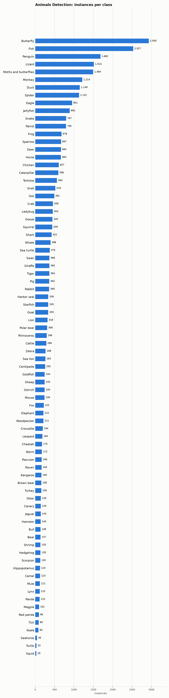

# Animals Detection: Dataset Statistics

## About

Animals Detection Images Dataset is an 80-class wildlife/animal detection benchmark drawn from Google Open Images, spanning mammals, birds, reptiles, fish, and invertebrates (e.g. lion, zebra, eagle, jellyfish, butterfly). It's used to benchmark broad-taxonomy animal detection -- the widest class vocabulary of any dataset in DetectionBench.

Computed from the canonical COCO layout produced by `detectionbench-prepare-coco --dataset animalsdet`. See the adapter and Hydra config for how these splits are built.

## Split Summary

| Split | Images | Instances | Instances / Image |
| :--- | ---: | ---: | ---: |
| train | 18,402 | 24,091 | 1.31 |
| valid | 3,247 | 4,123 | 1.27 |
| test | 6,003 | 7,576 | 1.26 |
| **Total** | **27,652** | **35,790** | **1.29** |

## Class Distribution



| Class | Instances | Share |
| :--- | ---: | ---: |
| Butterfly | 2,930 | 8.2% |
| Fish | 2,527 | 7.1% |
| Penguin | 1,682 | 4.7% |
| Lizard | 1,514 | 4.2% |
| Moths and butterflies | 1,494 | 4.2% |
| Monkey | 1,214 | 3.4% |
| Duck | 1,149 | 3.2% |
| Spider | 1,131 | 3.2% |
| Eagle | 951 | 2.7% |
| Jellyfish | 891 | 2.5% |
| Snake | 797 | 2.2% |
| Parrot | 795 | 2.2% |
| Frog | 678 | 1.9% |
| Sparrow | 667 | 1.9% |
| Deer | 664 | 1.9% |
| Horse | 663 | 1.9% |
| Chicken | 607 | 1.7% |
| Caterpillar | 596 | 1.7% |
| Tortoise | 560 | 1.6% |
| Snail | 519 | 1.5% |
| Owl | 491 | 1.4% |
| Crab | 458 | 1.3% |
| Ladybug | 453 | 1.3% |
| Goose | 445 | 1.2% |
| Squirrel | 439 | 1.2% |
| Shark | 422 | 1.2% |
| Whale | 396 | 1.1% |
| Sea turtle | 375 | 1.0% |
| Swan | 366 | 1.0% |
| Giraffe | 365 | 1.0% |
| Tiger | 364 | 1.0% |
| Pig | 362 | 1.0% |
| Rabbit | 360 | 1.0% |
| Harbor seal | 336 | 0.9% |
| Starfish | 335 | 0.9% |
| Goat | 335 | 0.9% |
| Lion | 318 | 0.9% |
| Polar bear | 308 | 0.9% |
| Rhinoceros | 296 | 0.8% |
| Cattle | 286 | 0.8% |
| Zebra | 268 | 0.7% |
| Sea lion | 263 | 0.7% |
| Centipede | 255 | 0.7% |
| Goldfish | 244 | 0.7% |
| Sheep | 243 | 0.7% |
| Ostrich | 243 | 0.7% |
| Mouse | 239 | 0.7% |
| Fox | 222 | 0.6% |
| Elephant | 212 | 0.6% |
| Woodpecker | 211 | 0.6% |
| Crocodile | 194 | 0.5% |
| Leopard | 184 | 0.5% |
| Cheetah | 175 | 0.5% |
| Worm | 172 | 0.5% |
| Raccoon | 166 | 0.5% |
| Raven | 165 | 0.5% |
| Kangaroo | 160 | 0.4% |
| Brown bear | 158 | 0.4% |
| Turkey | 156 | 0.4% |
| Otter | 145 | 0.4% |
| Canary | 145 | 0.4% |
| Jaguar | 143 | 0.4% |
| Hamster | 140 | 0.4% |
| Bull | 138 | 0.4% |
| Bear | 137 | 0.4% |
| Shrimp | 135 | 0.4% |
| Hedgehog | 135 | 0.4% |
| Scorpion | 130 | 0.4% |
| Hippopotamus | 123 | 0.3% |
| Camel | 123 | 0.3% |
| Mule | 121 | 0.3% |
| Lynx | 115 | 0.3% |
| Panda | 114 | 0.3% |
| Magpie | 101 | 0.3% |
| Red panda | 96 | 0.3% |
| Tick | 89 | 0.2% |
| Koala | 83 | 0.2% |
| Seahorse | 46 | 0.1% |
| Turtle | 33 | 0.1% |
| Squid | 29 | 0.1% |

## Bounding Box Geometry

- Median box area: **32.35%** of image area (mean 36.81%)
- Instances per image: mean **1.29**, median **1**, max **123**

## References

**Citation:**

```bibtex
@misc{openimages,
  title={OpenImages: A public dataset for large-scale multi-label and multi-class image classification.},
  author={Krasin, Ivan and Duerig, Tom and Alldrin, Neil and Ferrari, Vittorio and Abu-El-Haija, Sami and Kuznetsova, Alina and Rom, Hassan and Uijlings, Jasper and Popov, Stefan and Veit, Andreas and others},
  year={2017}
}
```

- Project website: <https://www.kaggle.com/datasets/antoreepjana/animals-detection-images-dataset>

---

Regenerate this report with:

```bash
python -m detectionbench.scripts.dataset_stats --coco-dir <animalsdet_coco> --dataset animalsdet --output-dir docs/datasets/animalsdet
```
