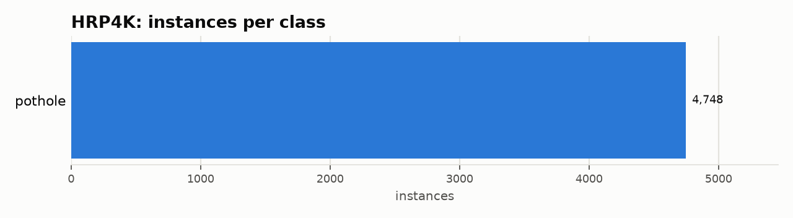

# HRP4K: Dataset Statistics

## About

HRP4K (High-Resolution Pothole 4K) is a perspective-view road pothole-detection benchmark: 4,086 usable high-resolution road images (per this adapter's on-disk counts -- see module docstring for a known upstream train-split completeness gap) with 4,748 pothole instances, captured for automated road-condition assessment. It is a single-class, dense-detection style benchmark similar in spirit to RDD2022's pothole class, but pothole-specific and at much higher image resolution.

Computed from the canonical COCO layout produced by `detectionbench-prepare-coco --dataset hrp4k`. See the adapter and Hydra config for how these splits are built.

## Split Summary

| Split | Images | Instances | Instances / Image |
| :--- | ---: | ---: | ---: |
| train | 2,286 | 2,790 | 1.22 |
| valid | 900 | 1,037 | 1.15 |
| test | 900 | 921 | 1.02 |
| **Total** | **4,086** | **4,748** | **1.16** |

## Class Distribution



| Class | Instances | Share |
| :--- | ---: | ---: |
| pothole | 4,748 | 100.0% |

## Bounding Box Geometry

- Median box area: **0.05%** of image area (mean 0.27%)
- Instances per image: mean **1.16**, median **1**, max **28**

## References

**Citation:**

```bibtex
@article{chen2026hrp4k,
  title={A high-resolution perspective-view road image dataset for pothole detection},
  author={Chen, Hanshen and Tu, Zhoulin and Zhao, Yu and Ye, Jianfeng},
  journal={Scientific Data},
  volume={13},
  pages={961},
  year={2026},
  doi={10.1038/s41597-026-07317-w}
}
```

- Project website: <https://github.com/hanshenChen/HRP4K>

---

Regenerate this report with:

```bash
python -m detectionbench.scripts.dataset_stats --coco-dir <hrp4k_coco> --dataset hrp4k --output-dir docs/datasets/hrp4k
```
