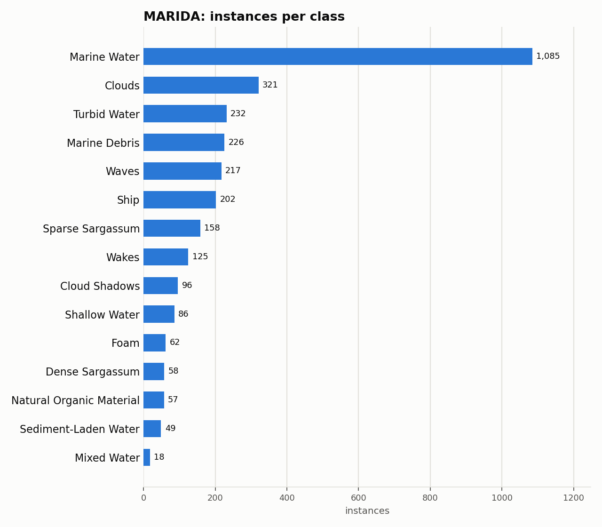

# MARIDA: Dataset Statistics

## About

MARIDA (Marine Debris Archive) is a Sentinel-2 satellite-imagery dataset for marine debris and related ocean-surface phenomena: 1,381 256x256 patches (11-band reflectance) with per-pixel classification masks across 15 classes -- marine debris, sargassum, ships, foam, and several water/ cloud context classes. It's used to benchmark marine-debris monitoring from freely-available satellite data; this adapter converts its native weakly-supervised segmentation masks into bounding boxes via connected-component extraction.

Computed from the canonical COCO layout produced by `detectionbench-prepare-coco --dataset marida`. See the adapter and Hydra config for how these splits are built.

## Split Summary

| Split | Images | Instances | Instances / Image |
| :--- | ---: | ---: | ---: |
| train | 694 | 1,533 | 2.21 |
| valid | 328 | 713 | 2.17 |
| test | 359 | 746 | 2.08 |
| **Total** | **1,381** | **2,992** | **2.17** |

## Class Distribution



| Class | Instances | Share |
| :--- | ---: | ---: |
| Marine Water | 1,085 | 36.3% |
| Clouds | 321 | 10.7% |
| Turbid Water | 232 | 7.8% |
| Marine Debris | 226 | 7.6% |
| Waves | 217 | 7.3% |
| Ship | 202 | 6.8% |
| Sparse Sargassum | 158 | 5.3% |
| Wakes | 125 | 4.2% |
| Cloud Shadows | 96 | 3.2% |
| Shallow Water | 86 | 2.9% |
| Foam | 62 | 2.1% |
| Dense Sargassum | 58 | 1.9% |
| Natural Organic Material | 57 | 1.9% |
| Sediment-Laden Water | 49 | 1.6% |
| Mixed Water | 18 | 0.6% |

## Bounding Box Geometry

- Median box area: **0.02%** of image area (mean 0.64%)
- Instances per image: mean **2.17**, median **1**, max **23**

## References

**Citation:**

```bibtex
@article{kikaki2022marida,
  title={MARIDA: A benchmark for Marine Debris detection from Sentinel-2 remote sensing data},
  author={Kikaki, Katerina and Kakogeorgiou, Ioannis and Mikeli, Paraskevi and Raitsos, Dionysios E. and Karantzalos, Konstantinos},
  journal={PLOS ONE},
  volume={17},
  number={1},
  pages={e0262247},
  year={2022}
}
```

- Project website: <https://marine-debris.github.io/>
- GitHub: <https://github.com/marine-debris/marine-debris.github.io>

---

Regenerate this report with:

```bash
python -m detectionbench.scripts.dataset_stats --coco-dir <marida_coco> --dataset marida --output-dir docs/datasets/marida
```
