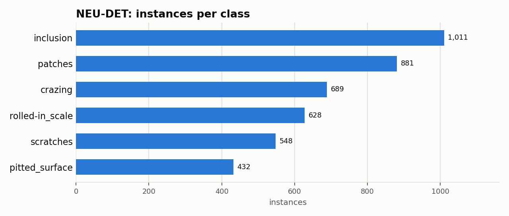

# NEU-DET: Dataset Statistics

## About

NEU-DET is a hot-rolled steel strip surface-defect detection benchmark: 1,800 grayscale 200x200 images (300 per class) across six defect types -- crazing, inclusion, patches, pitted surface, rolled-in scale, and scratches. It's used to benchmark automated defect localization for steel-manufacturing quality control, complementing GC10-DET's metallic-surface-defect taxonomy with a different steel-inspection domain.

Computed from the canonical COCO layout produced by `detectionbench-prepare-coco --dataset neudet`. See the adapter and Hydra config for how these splits are built.

## Split Summary

| Split | Images | Instances | Instances / Image |
| :--- | ---: | ---: | ---: |
| train | 1,440 | 3,351 | 2.33 |
| valid | 180 | 396 | 2.20 |
| test | 180 | 442 | 2.46 |
| **Total** | **1,800** | **4,189** | **2.33** |

## Class Distribution



| Class | Instances | Share |
| :--- | ---: | ---: |
| inclusion | 1,011 | 24.1% |
| patches | 881 | 21.0% |
| crazing | 689 | 16.4% |
| rolled-in_scale | 628 | 15.0% |
| scratches | 548 | 13.1% |
| pitted_surface | 432 | 10.3% |

## Bounding Box Geometry

- Median box area: **11.79%** of image area (mean 17.45%)
- Instances per image: mean **2.33**, median **2**, max **9**

## References

**Citation:**

```bibtex
@article{he2020end,
  title={An End-to-end Steel Surface Defect Detection Approach via Fusing Multiple Hierarchical Features},
  author={He, Yu and Song, Kechen and Meng, Qinggang and Yan, Yunhui},
  journal={IEEE Transactions on Instrumentation and Measurement},
  volume={69},
  number={4},
  pages={1493--1504},
  year={2020}
}
```

- Project website: <http://faculty.neu.edu.cn/songkc/en/zdylm/263265/list/index.htm>

---

Regenerate this report with:

```bash
python -m detectionbench.scripts.dataset_stats --coco-dir <neudet_coco> --dataset neudet --output-dir docs/datasets/neudet
```
