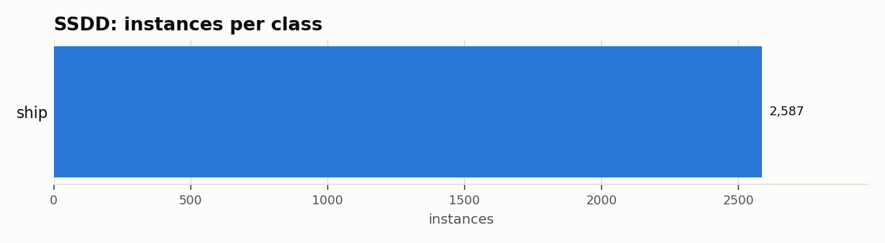

# SSDD: Dataset Statistics

## About

SSDD (SAR Ship Detection Dataset) is a benchmark for ship detection in Synthetic Aperture Radar imagery: 1,160 images with 2,587 ship instances, composited from RadarSat-2, TerraSAR-X, and Sentinel-1 at resolutions from 1m to 15m, across multiple polarizations and both inshore and offshore scenes. It's used to benchmark SAR ship detection, where speckle noise and side-lobe artifacts make optical-trained detectors unreliable -- the same problem HRSID targets, from a different sensor mix.

Computed from the canonical COCO layout produced by `detectionbench-prepare-coco --dataset ssdd`. See the adapter and Hydra config for how these splits are built.

## Split Summary

| Split | Images | Instances | Instances / Image |
| :--- | ---: | ---: | ---: |
| train | 789 | 1,756 | 2.23 |
| valid | 139 | 285 | 2.05 |
| test | 232 | 546 | 2.35 |
| **Total** | **1,160** | **2,587** | **2.23** |

## Class Distribution



| Class | Instances | Share |
| :--- | ---: | ---: |
| ship | 2,587 | 100.0% |

## Bounding Box Geometry

- Median box area: **0.38%** of image area (mean 1.01%)
- Instances per image: mean **2.23**, median **1**, max **29**

## References

**Citation:**

```bibtex
@article{zhang2021sar,
  title={SAR Ship Detection Dataset (SSDD): Official Release and Comprehensive Data Analysis},
  author={Zhang, Tianwen and Zhang, Xiaoling and Li, Jianwei and Xu, Xiaowo and Wang, Baoyou and Zhan, Xu and Xu, Yanqin and Ke, Xu and Zeng, Tianjiao and Su, Hao and others},
  journal={Remote Sensing},
  volume={13},
  number={18},
  pages={3690},
  year={2021}
}
```

- Project website: <https://github.com/TianwenZhang0825/Official-SSDD>

---

Regenerate this report with:

```bash
python -m detectionbench.scripts.dataset_stats --coco-dir <ssdd_coco> --dataset ssdd --output-dir docs/datasets/ssdd
```
